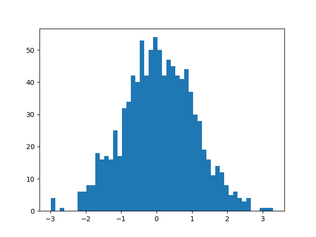
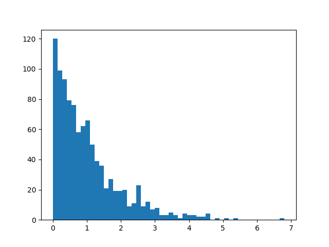
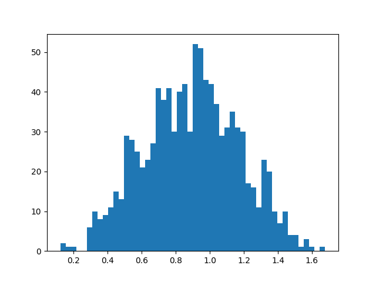

# Anomaly Detection Notes

Anomaly Detection (also called Outlier Detection) is a technique used to identify data points that deviate significantly from the majority of the data. It is especially useful when the dataset is unbalanced — most data points represent "normal" behavior, and a small fraction are "anomalies" (e.g., fraud, defects, intrusions).

**Core Idea:**  
Anomaly detection models learn what "normal" looks like and then flag anything that does not fit that pattern.

---

## Gaussian-Based Anomaly Detection Workflow

#### Step 1: Estimate Parameters from Training Data

Compute the mean $\mu$ and variance $\sigma^2$ of the feature(s):

$$
\mu = \frac{1}{m} \sum_{i=1}^m x^{(i)}, \quad
\sigma^2 = \frac{1}{m} \sum_{i=1}^m \left(x^{(i)} - \mu\right)^2
$$

#### Step 2: Compute Probability Density $p(x)$

For data point $x$, calculate the likelihood under the Gaussian:

$$
p(x) = \frac{1}{\sqrt{2\pi\sigma^2}}e^{\left(-\frac{(x - \mu)^2}{2\sigma^2}\right)}
$$

- High $p(x)$ means point is likely normal
- Low $p(x)$ means point may be anomalous

#### Step 3: Select Threshold $\varepsilon$

- Use a labeled cross-validation set.
- For each candidate $\varepsilon$, classify:
  - If $p(x) < \varepsilon$, flag as anomaly
  - Otherwise, normal
- Compute evaluation metrics (Precision, Recall, F1-score)
- Choose $\varepsilon$ that optimizes the desired metric.

If no labeled data is available, use percentiles of $p(x)$ (e.g., 1st or 5th percentile) as heuristic thresholds.

#### Step 4: Apply to Test Data

- Compute $p(x) $ for test points.
- Flag points with $p(x) < \varepsilon $ as anomalies.

### Calculating $p(x) $ for Multiple Features (Assuming Independence)

Given a feature vector $x = (x_1, x_2, \ldots, x_n) $, assume each feature is independent and follows its own Gaussian distribution with parameters $\mu_j, \sigma_j^2 $.

Then:

$$
p(x) = \prod_{j=1}^n p(x_j; \mu_j, \sigma_j^2) = \prod_{j=1}^n \frac{1}{\sqrt{2\pi\sigma_j^2}} \exp\left(-\frac{(x_j - \mu_j)^2}{2\sigma_j^2}\right)
$$

In practice, we multiply the individual feature probabilities.

### Feature Gaussianity Check & Transformation

In **Gaussian-based anomaly detection**, we assume that **each feature** follows a **normal (Gaussian) distribution**.

If a feature **is not Gaussian** (e.g., skewed or has multiple peaks), the algorithm will:

- Estimate the mean (μ) and standard deviation (σ) incorrectly.
- Compute the probability density \( p(x) \) inaccurately.
- This can cause **false positives** (normal points marked as anomalies) or **false negatives** (miss actual anomalies).

Lets generate a gaussian distribution and a non gaussian distribution and try to convert it into gaussian distribution

```python
import matplotlib.pyplot as plt
import numpy as np

gaussian = np.random.normal(0, 1, 1000)
#generates a normal/gaussian distribution of length 1000

right_skewed = np.random.exponential(scale=1.0, size=1000)
#generates a exponential/non gaussian distribution of length 1000

plt.hist(gaussian, bins=50) #generates a histogram for the gaussian distribution
plt.hist(right_skewed, bins=50) #generates a histogram for the right_skewed distribution
```

Gaussian Distribution:



Non Gaussian Distribution:



We can apply transformations to make skewed data closer to a Gaussian shape.
Common transformations include:

- **Log transform** → Good for right-skewed data with positive values.
- **Square root** → Similar to log but less aggressive.
- **Box-Cox or Yeo-Johnson** → More flexible methods that find the best power transformation automatically

```python
plt.hist(right_skewed**0.28, bins=50)
```



When you transform a feature, the actual values change, so the anomalies you detect will be based on the transformed scale, not the original scale.

- This is fine if you consistently apply the same transformation to both training and new incoming data.
- But it’s important to interpret anomalies in the context of the transformed data.
