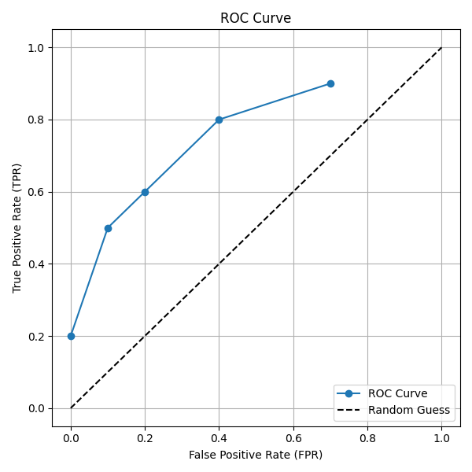
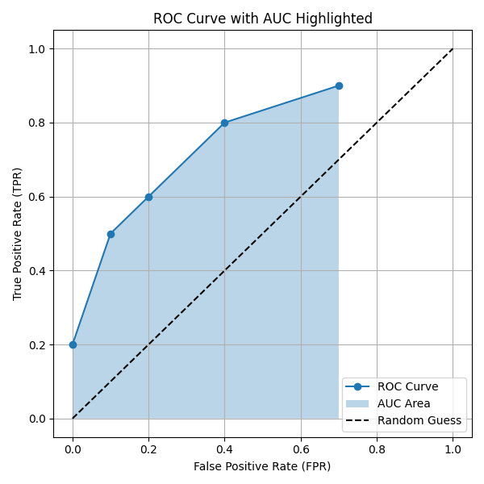

# Classification: From Probabilities to Classes

Imagine your spam detector shows a sidebar with 0%, 1%, 2%…100% “spam”—that’s useless! We want **labels**, not raw probabilities.

**Classification** predicts which class an example belongs to (e.g., Spam vs. Not Spam) by converting the output of a model like logistic regression into discrete categories.

---

## Threshold

A **Threshold** is simply the cutoff probability you choose to turn a model’s output

Suppose your model predicts a probability $p\in[0,1]$ (e.g., $p=0.50$ → 50% chance of spam; $p=0.75$ → 75% chance). To classify, you pick a cutoff $t$: if $p > t$, label **Spam**; otherwise, **Not Spam**. This *t* is called the **Threshold**

Although $t=0.5$ is a common starting point, it can backfire when spam is extremely rare (say 0.01%) or when marking a real email as spam is worse than missing one. Raising $t$ cuts down on false positives; lowering $t$ catches more spam. Choose $t$ based on class imbalance and whether false alarms or misses are costlier.

# Confusion Matrix

A **confusion matrix** summarizes a binary classifier’s performance by comparing its **predicted** labels (rows) against the **actual** labels (columns). It helps you see not only overall accuracy but also the types of errors your model makes.

### Confusion Matrix Table

|                         | **Actual Spam** (Positive) | **Actual Not Spam** (Negative) |
| ----------------------- | :------------------------: | :----------------------------: |
| **Predicted Spam**      | **True Positive (TP)**     | **False Positive (FP)**        |
| **Predicted Not Spam**  | **False Negative (FN)**    | **True Negative (TN)**         |

### Cell Definitions

- **True Positive (TP)**  
  Model predicts **Spam**, and the email **is** Spam.  
  *Good*: catches real spam.

- **False Positive (FP)**  
  Model predicts **Spam**, but the email **isn’t** Spam.  
  *“False alarm”*: legitimate email wrongly filtered.

- **False Negative (FN)**  
  Model predicts **Not Spam**, but the email **is** Spam.  
  *“Miss”*: spam sneaks into the inbox.

- **True Negative (TN)**  
  Model predicts **Not Spam**, and the email **isn’t** Spam.  
  *Good*: puts spam into bin

### Imbalanced Dataset Example

In spam filtering, “Spam” is often much rarer than “Not Spam.”  
- Total emails: **10 000**  
  - **100** Spam (1%)  
  - **9 900** Not Spam (99%)  

A classifier that always predicts “Not Spam” would be 99% accurate but catch zero spam. The confusion matrix exposes this flaw by breaking down errors.

### Why It Matters

- **Accuracy illusion**: with 99% “Not Spam,” always predicting negative yields 99% accuracy—but zero TP.  
- **Imbalance-aware metrics**: use **precision** and **recall** instead of raw accuracy:  
  - Precision = TP / (TP + FP)  
  - Recall = TP / (TP + FN)  
- **Model adjustments**: consider resampling, threshold tuning, or cost‑sensitive training to handle class imbalance.

---

## Accuracy

**Accuracy** measures the overall fraction of correct predictions:

$$\text{Accuracy} = \frac{TP + TN}{TP + TN + FP + FN}$$

- **TP** (True Positive): correctly predicted Spam  
- **TN** (True Negative): correctly predicted Not Spam  
- **FP** (False Positive): non‑spam flagged as Spam  
- **FN** (False Negative): spam missed and marked Not Spam  

### When It Works

- **Balanced data** (similar counts of Spam and Not Spam):  
  Accuracy gives a quick, coarse‑grained view of performance.

### Caveats

- **Imbalanced data** (e.g., 1% spam, 99% not‑spam):  
  A dumb model that always predicts Not Spam scores 99% accuracy yet catches zero spam. So it is completely failing in the job it was designed to do yet it has 99% accuracy.
- **Unequal error costs**:  
  If missing spam (FN, spam missed and marked Not Spam) is costlier than a false alarm (FP, non‑spam flagged as Spam), accuracy alone won’t capture that trade‑off.

### Takeaways

- Use accuracy as a first check on **balanced** problems.  
- On **imbalanced** datasets or when one error type is more serious, complement or replace it with:
  - **Precision** (focus on FP)  
  - **Recall** (focus on FN)  
  - **F1 score** (harmonic mean of precision & recall)

---

## Recall (True Positive Rate)

**Formula:**

$$
\text{Recall} = \frac{TP}{TP + FN}
$$

- **TP (True Positive):** Spam emails correctly identified as spam  
- **FN (False Negative):** Spam emails wrongly labeled as Not Spam

🔍 **Recall answers:**  
> “Out of all actual spam emails, how many did the model catch?”

### 📬 Spam Example:
- You have **100 spam emails**
- Your model catches **80**, misses **20**
- Then:  
$$
\text{Recall} = \frac{80}{80 + 20} = 80\%
$$

### 🧠 When to focus on Recall:
- When **missing positives is costly**  
  e.g., fraud detection, cancer detection, spam that causes harm

### ⚠️ When Recall isn't enough:
- If precision is low, the model may catch lots of spam but also mislabel many legit emails.

---

## Precision

**Formula:**

$$\text{Precision} = \frac{TP}{TP + FP}$$

- **TP (True Positive):** Spam emails correctly marked as spam  
- **FP (False Positive):** Legitimate emails wrongly marked as spam

🔍 **Precision answers:**  
> “Out of all emails flagged as spam, how many were actually spam?”

### 📬 Spam Example:
- Model flags **120 emails** as spam  
- Only **80 are actually spam**  
- Then:  
$$\text{Precision} = \frac{80}{80 + 40} \approx 66.7\%$$

### 🧠 When to focus on Precision:
- When **false alarms are costly**  
  e.g., marking important legit emails as spam

### ⚠️ When Precision isn't enough:
- High precision might mean you're playing it too safe and **missing a lot of spam** (low recall).

---

## 🚨 False Positive Rate (FPR)

**Formula:**

$$\text{FPR} = \frac{FP}{FP + TN}$$

- **FP (False Positive):** Legitimate emails flagged as spam  
- **TN (True Negative):** Legitimate emails correctly marked as Not Spam

🔍 **FPR answers:**  
> “Out of all legitimate emails, how many did the model wrongly flag as spam?”  
> Also called the **"probability of false alarm"**

### 📬 Spam Example:
- Out of **9900 legit emails**, 100 are wrongly flagged (FP), 9800 are correctly left alone (TN)  
- Then:  
$$\text{FPR} = \frac{100}{100 + 9800} = 1\%$$

### 🧠 When FPR matters:
- Important in real-world systems where **legit users should not be wrongly flagged**

### ⚠️ When FPR is less useful:
- If the number of negatives is **very low**, the FPR becomes unstable (small denominator).

---

## Precision vs Recall: The Trade-Off

Changing the **classification threshold** (the cutoff used to decide “spam” or “not spam”) affects precision and recall:

- **Higher threshold**  
  → model is more cautious  
  → **↑ precision**, **↓ recall**  
  → catches fewer spam, but makes fewer mistakes

- **Lower threshold**  
  → model is more aggressive  
  → **↑ recall**, **↓ precision**  
  → catches more spam, but risks flagging legit mail

You often **can’t maximize both** at the same time—so you must decide which error matters more.

---

## ⚖️ When to Use What?

| Metric       | Use When...                                             | Not Ideal When...                                               |
|--------------|---------------------------------------------------------|------------------------------------------------------------------|
| **Recall**   | Missing positives is worse than false alarms — e.g., you want to catch **as much spam as possible**, even if a few legit emails get marked wrongly | False positives are very costly — e.g., **you can't afford to wrongly flag important legit emails as spam** |
| **Precision**| False alarms are worse than missed positives — e.g., you're fine missing a few spam emails **as long as no legit email is wrongly flagged** | You don’t mind some mistakes, but want to **catch as much spam as possible** |
| **FPR**      | You want to control false alarms — e.g., **you want to minimize how often legit emails get marked as spam** | There are too few legit (Not Spam) emails to reliably measure — e.g., **when almost all emails are spam**, so FPR becomes meaningless |

---

## 🎯 F1 Score

The **F1 score** is the **harmonic mean** of **precision** and **recall** — a special kind of average that punishes large differences between the two.

### 🧮 Formula:

$$\text{F1 Score} = 2 \cdot \frac{\text{Precision} \cdot \text{Recall}}{\text{Precision} + \text{Recall}}$$

It gives a single score that balances **both**:
- **Precision**: How many predicted spam emails were actually spam  
- **Recall**: How many actual spam emails the model successfully caught

### 📨 Spam Example:

- Precision = 0.80 (80% of flagged emails were truly spam)  
- Recall = 0.60 (caught 60% of all actual spam)

Then:

$$\text{F1} = 2 \cdot \frac{0.80 \cdot 0.60}{0.80 + 0.60} = 2 \cdot \frac{0.48}{1.40} \approx 0.686$$

So, F1 Score ≈ 68.6%

### 📌 Key Insights:

- **F1 = 1.0** only when **both precision and recall are perfect**
- If **precision and recall are close**, F1 is also close to them  
  (e.g., precision = 0.8, recall = 0.75 → F1 ≈ 0.775)
- If **precision and recall are very different**, F1 drops closer to the worse one  
  (e.g., precision = 0.9, recall = 0.1 → F1 ≈ 0.18)

### ✅ Why Use F1?

- Accuracy is misleading in imbalanced datasets (e.g., 1% spam)  
- F1 gives a **balanced view** of the model’s ability to catch spam **without too many false alarms**
- Great for real-world tasks where **you care about both catching positives and avoiding mistakes**

---

## 📈 ROC and AUC

In binary classification (like spam detection), models give probability scores. But choosing **one threshold** can hide the model’s full behavior.  
**ROC Curve** and **AUC** help us evaluate the model across **all possible thresholds**.

**ROC (Receiver Operating Characteristic) Curve** plots:

- **True Positive Rate (TPR)** = Recall  
  > Out of all actual spam emails, how many were correctly predicted as spam  
- **False Positive Rate (FPR)**  
  > Out of all actual legitimate emails, how many were wrongly predicted as spam

The ROC curve shows **how TPR and FPR change** as we **adjust the threshold** from high to low.

---

### 📬 Example: Spam Classification

Let’s say we have:
- **10 actual spam emails**
- **10 actual not-spam emails**
- Each email has a **predicted spam score** (between 0 and 1)

Here are the scores:

### Spam Email Scores (actual positives):
[0.95, 0.90, 0.85, 0.80, 0.70, 0.60, 0.55, 0.40, 0.30, 0.10]

### Not-Spam Email Scores (actual negatives):
[0.65, 0.50, 0.45, 0.35, 0.25, 0.20, 0.15, 0.12, 0.08, 0.02]

We’ll test 5 thresholds and calculate the TPR and FPR at each:

| **Threshold** | TP | FN | FP | TN | **TPR** | **FPR** |
|---------------|----|----|----|----|---------|---------|
| 0.90          | 2  | 8  | 0  | 10 | 0.20    | 0.00    |
| 0.70          | 5  | 5  | 1  | 9  | 0.50    | 0.10    |
| 0.50          | 6  | 4  | 2  | 8  | 0.60    | 0.20    |
| 0.30          | 8  | 2  | 4  | 6  | 0.80    | 0.40    |
| 0.10          | 9  | 1  | 7  | 3  | 0.90    | 0.70    |

### 🧭 Interpreting the ROC Curve

- **X-axis:** False Positive Rate  
- **Y-axis:** True Positive Rate  
- Each point = a threshold  
- Connecting all points gives the **ROC curve**

### ✅ A good model:
- Rises quickly to top-left (high TPR, low FPR)
- The **closer to (0,1)** the curve goes, the better

---

## 🧮 What is AUC?

**AUC (Area Under Curve)** = Total area under the ROC curve  
It gives a **single value** summarizing the model’s ability to distinguish between the classes:

| AUC Value | Meaning                                 |
|-----------|-----------------------------------------|
| **1.0**   | Perfect classifier                      |
| **0.9**   | Excellent model                         |
| **0.5**   | No better than random guessing          |
| **< 0.5** | Worse than random (model is flipped)    |

### 📌 Intuition:

If you pick 1 random spam and 1 random not-spam email,  
**AUC = probability** that the spam email will get a **higher score** than the not-spam email.

