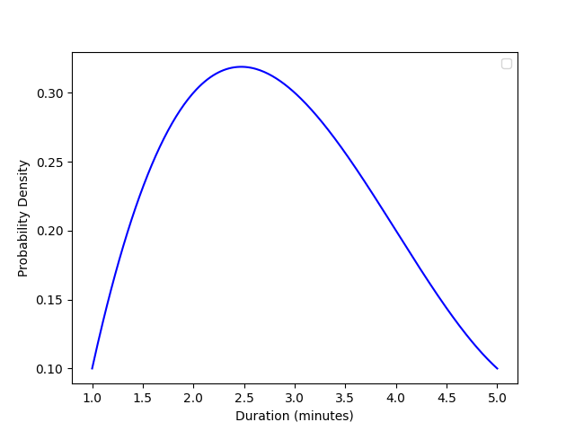

# Probability

## Introduction

Probability measures how likely an event is to occur, on a scale from 0 (impossible) to 1 (certain). Below are the key concepts we have covered:

- **Sample space (S)**: the set of all possible outcomes.
- **Event (A)**: any subset of the sample space.
- **Probability of an event** (for equally likely outcomes):
  $P(A) = \frac{|A|}{|S|}$
- **Notation**:

  - $P(A)$ denotes the probability that event $A$ occurs.
  - For a random variable $X$, $P(X = x)$ is the probability that $X$ takes value $x$.

- **Complement of an event**: the event that $A$ does not occur, denoted $A^c$, with
  $P(A^c) = 1 - P(A) = \frac{|S| - |A|}{|S|}.$

**Example: Rolling a fair six-sided die**

- Sample space: $S = \{1,2,3,4,5,6\}$.
- Event "roll a 6": $A = \{6\}$, so $|A| = 1$ and $|S| = 6$.

Probability of rolling a 6:
$P(A) = \frac{1}{6} \approx 0.17$
Probability of not rolling a 6:
$P(A^c) = 1 - \tfrac{1}{6} = \tfrac{5}{6} \approx 0.83$

---

## Disjoint Events (Mutually Exclusive)

Two events are **disjoint** if they cannot occur at the same time. In other words, they have no outcomes in common.

### Definition:

$$A \cap B = \emptyset$$
$$P(A \cap B) = 0$$

### Rule:

If events A and B are disjoint:  
$$P(A \cup B) = P(A) + P(B)$$

### Example:

- Event A = {1, 2} (rolling a 1 or 2)
- Event B = {5, 6} (rolling a 5 or 6)
- These are disjoint because no outcome is shared.
- So:  
  $$P(A \cup B) = P(A) + P(B) = \frac{2}{6} + \frac{2}{6} = \frac{4}{6} = 0.67$$

---

## Joint (Overlapping) Events

These are events that can both occur; they share some common outcomes.

#### Rule:

$$P(A \cup B) = P(A) + P(B) - P(A \cap B)$$

#### Example:

- Event A = {2, 4, 6} (even numbers)
- Event $$B = {4, 5, 6} (greater than 3)
- Overlap: $$A \cap B = \{4, 6\}$$
- So:  
  $$P(A) = \frac{3}{6},\quad P(B) = \frac{3}{6},\quad P(A \cap B) = \frac{2}{6}$$  
  $$P(A \cup B) = \frac{3}{6} + \frac{3}{6} - \frac{2}{6} = \frac{4}{6}$$

---

## Independent Events

Two events are **independent** if the occurrence of one does **not affect** the probability of the other.

### Definition:

$$P(A \cap B) = P(A) \cdot P(B)$$

### Example: Rolling a die twice

- Let A = first roll is 6 → $$P(A) = \frac{1}{6}$$
- Let B = "second roll is 6" → $$P(B) = \frac{1}{6}$$
- The rolls are independent, so:  
  $$P(A \cap B) = \frac{1}{6} \cdot \frac{1}{6} = \frac{1}{36}$$

### Note:

- **Disjoint** events cannot occur together (if one happens, the other can't) → always dependent if P > 0.
- **Independent** events can occur together, but don’t influence each other.

## Conditional Probability

Conditional probability is the probability of an event occurring **given that** another event has already occurred.

#### Formula:

$$P(B \mid A) = \frac{P(A \cap B)}{P(A)}$$

This tells us how to compute the probability of \(B\) when we know that \(A\) has already happened.

### Example 1: Flipping a Coin Twice

Let:

- \(A =\) first toss is heads → \(P(A) = \frac{1}{2}\)
- \(B =\) second toss is heads → \(P(B \mid A) = \frac{1}{2}\)

Then the probability of both being heads:
$$P(A \cap B) = P(A) \cdot P(B \mid A) = \frac{1}{2} \cdot \frac{1}{2} = \frac{1}{4}$$

If the first toss is already known to be heads (so \(P(A) = 1\)):
$$P(B \mid A) = \frac{1}{2} \div 1 = \frac{1}{2}$$

### Example 2: Students Wearing Shoes

- Total students = 100
- 40 like soccer → \(P(S) = \frac{40}{100} = 0.4\)
- 80% of soccer lovers wear shoes → \(P(W \mid S) = 0.8\)

To find the probability that a randomly selected student **loves soccer and wears shoes**:
$$P(S \cap W) = P(S) \cdot P(W \mid S) = 0.4 \cdot 0.8 = 0.32$$

This means 32% of the total students both love soccer and wear shoes.

## Bayes Theorem

Bayes’ Theorem helps us find the probability of a cause (like an email being spam) **given** an effect (like seeing the word “lottery” in the email).
It answers:  
"If I see this word, what’s the chance the email is spam?"
In simple words:

$$
\text{Probability of A given B} = \frac{\text{count of A and B together}}{\text{count of B}}
$$

$$
P(A \mid B) = \frac{P(B \mid A) \cdot P(A)}{P(B)}
$$

Where:

- **P(A | B)** = Probability of event A happening given B happened
- **P(B | A)** = Probability of event B happening given A happened
- **P(A)** = Probability of A
- **P(B)** = Total probability of B happening (both with A and without A)

### Bayes’ Theorem – Email Spam Example

**Problem Setup**:

- Total emails: 100
- Spam emails: 20
- Non-spam emails: 80
- Spam emails with word “lottery”: 14
- Non-spam emails with “lottery”: 10

We want to calculate:

##### Example 1: What’s the probability an email is **spam**, given it contains the word **lottery**?

- **P(Spam)** = 20/100 = 0.2
- **P(Lottery | Spam)** = 14/20 = 0.7
- **P(Lottery | Not Spam)** = 10/80 = 0.125
- **P(Lottery)** = (14 + 10)/100 = 0.24

$$
P(Spam \mid Lottery) = \frac{P(Lottery \mid Spam) \cdot P(Spam)}{P(Lottery)}
= \frac{0.7 \cdot 0.2}{0.24}
= \frac{0.14}{0.24}
\approx 0.583
$$

So, there's a **58.3%** chance that an email is spam if it contains the word “lottery”.

##### Example 2: What’s the probability of spam, given, two Words (Lottery + Money)

Email Distribution:

- Total emails: 1000
- Spam emails: 300 (30%)
- Ham emails: 700 (70%)

Word Occurrence Data:

- Emails containing "free": 240 total (180 spam, 60 ham)
- Emails containing "offer": 280 total (150 spam, 130 ham)
- Emails containing BOTH "free" AND "offer": 100 total (90 spam, 10 ham)

Calculate:

- P(Spam) = 300/1000 = 0.3
- P(Free ∩ Offer | Spam) = 90/300 = 0.3
- P(Free ∩ Offer) = 100/1000 = 0.1
- P(Free ∩ Offer | Ham) = 10/700 = 0.0143

Using Bayes' Theorem:

P(Free ∩ Offer) = P(Spam) × P(Free ∩ Offer | Spam) + P(Ham) × P(Free ∩ Offer | Ham)

P(Free ∩ Offer) = 0.3 × 0.3 + 0.7 × 0.0143 = 0.09 + 0.01 = 0.1

$$
\text{P(Spam | Free ∩ Offer)} = \frac{\text{P(Free ∩ Offer | Spam) × P(Spam)}}{\text{P(Free ∩ Offer)}}
$$

$$
 = \frac{0.3*0.3}{0.1}
$$

Imagine if we had 10 words instead of 2:
["free", "offer", "urgent", "money", "winner", "click", "limited", "bonus", "deal", "act"]

With Normal Bayes, you would need:

- Joint probability of ALL 10 words together: P(Word1 ∩ Word2 ∩ ... ∩ Word10 | Spam)
- This requires 2^10 = 1,024 different combinations of word presence/absence
- You'd need data for each combination: some emails with words 1,3,7; others with 2,4,5,8, etc.
- Practically impossible to have enough data for all combinations!

## Using Naive Bayes (Assuming Independence)

Treating "free" and "offer" as independent features.

Calculate:

- P(Free | Spam) = 180/300 = 0.6
- P(Free | Ham) = 60/700 = 0.086
- P(Offer | Spam) = 150/300 = 0.5
- P(Offer | Ham) = 130/700 = 0.186

$$
\text{P(Spam | Free ∩ Offer)} = \frac{\text{P(Spam) × P(Free|Spam) × P(Offer|Spam)}}{\text{P(Spam) × P(Free|Spam) × P(Offer|Spam) + P(Ham) × P(Free|Ham) × P(Offer|Ham)}}
$$

$$
= 0.09 / (0.09 + 0.0112) = 0.09 / 0.1012 = 0.889
$$

As we can we see how the naive bayes makes our work easier while still being close to the normal bayes

## Random Variable

A **Random Variable** is a variable that takes on **numerical values** based on the **outcome of a random experiment**.

There are **two main types**:

### 1. Discrete Random Variable

- Takes **countable** values (like 0, 1, 2, 3, …).
- Examples:
  - Number of heads in 3 coin tosses
  - Number of students in a class
- Represented using a **Probability Mass Function (PMF)**.

### 2. Continuous Random Variable

- Takes **uncountably infinite** values (within an interval).
- Examples:
  - Height of students. It can 150cm, 150.1cm, 150.01cm, 150.001cm and so on, we can't count all the values between the interval
  - Time taken to complete a task
- Represented using a **Probability Density Function (PDF)**.

## Probability Distribution

A **Probability Distribution** describes **how the probabilities are distributed** over the **values of a random variable**.

It tells us:

- What are all the possible outcomes?
- What is the probability of each outcome?

### For Discrete Random Variables:

- The distribution is a list/table/function of **each possible value** and its corresponding **probability**.
- Sum of all probabilities must be **1**.
- Represented using a **Probability Mass Function (PMF)**.

#### Example (Tossing 3 coins):

Let X = number of heads
We know that when we toss 3 coins there can be total 4 outcomes, we get 0 Heads, 1 Heads, 2 Heads or 3 Heads

| X   | P(X)                |
| --- | ------------------- |
| 0   | 1/8 (TTT)           |
| 1   | 3/8 (HTT, THT, TTH) |
| 2   | 3/8 (HHT, HTH, THH) |
| 3   | 1/8 (HHH)           |

---

### Binomial Distribution

A **Binomial Distribution** models the probability of getting **a fixed number of successes** in a fixed number of **independent** trials, where each trial has **two outcomes**: success or failure.

Conditions for Binomial Distribution:

1. **Fixed number of trials (n)**
2. **Only two outcomes** in each trial — success or failure
3. **Constant probability of success (p)** in each trial
4. **Independent trials**

$$
P(X = k) =
\binom{n}{k} \cdot p^k \cdot (1 - p)^{n - k}
$$

Where,

- **n** = total number of trials
- **k** = number of successes
- **p** = probability of success in one trial
- **1 - p** = probability of failure
  $$
  \binom{n}{k} = \text{"n choose k" = number of ways to choose k successes from n trials}
  $$

#### Example:

Toss a biased coin **10 times** (n = 10), where the chance of getting heads (success) is 0.6 (p = 0.6).  
What is the probability of getting exactly **4 heads**?

So we have to choose only those outcomes where out of 10 coin tosses, 4 are heads, and that can be represented as $\binom{10}{4}$, which actually means $\frac{10!}{\text{(10-4)! * 4!}}$

$$
P(X = 4) =
\binom{10}{4} \cdot 0.6^4 \cdot (0.4)^6
$$

### Bernoulli Distribution

A **Bernoulli Distribution** models the probability of a **single trial** having one of **two outcomes**: success (1) or failure (0), with a fixed probability of success 𝑝

It is essentially a **Binomial Distribution with number of trials(n)=1**.

Conditions for Bernoulli Distribution

- **Only one trial** (n = 1)
- **Two outcomes** - Success(1) or Failure(0)
- **constant Probability of success(p)**
- **Independent Trial** (if considering multiple Bernoulli experiments)

$$
P(X) = p^x * (1-p)^{1-x}
$$

Where,
- **p** = probability of success
- **1 - p** = probability of failure
- **x = 1** means Success, **x = 0** means failure

---
### Continuous Distribution
---
### Cumulative Distribution

- A **CDF** shows how much probability the variable has accumulated until a certain value  
- It is defined as:  
  - **Discrete case:**  
    F(x) = P(X ≤ x) = Σ P(X = t), for all t ≤ x  
  - **Continuous case:**  
    F(x) = P(X ≤ x) = ∫ from -∞ to x of f(t) dt  

- **Properties of CDF:**
  - Starts at 0 and ends at 1.  
  - Always non-decreasing.  
  - Step-like shape for **discrete distributions**, smooth curve for **continuous distributions**.

#### Example (discrete value):
We have probabilities of a person’s height being a certain value:  

- 72 → 0.2  
- 73 → 0.4  
- 74 → 0.3  
- 75 → 0.1  

**PMF Table**  

| Height | Probability |
|--------------|-------------|
| 72        | 0.2         |
| 73        | 0.4         |
| 74        | 0.3         |
| 75        | 0.1         |

**CDF Table (cumulative sum):**  

| Height ≤ x   | CDF Value |
|--------------|-----------|
| ≤73          | 0.2       |
| ≤74          | 0.6       |
| ≤75          | 0.9       |
| ≤76          | 1.0       |

So the CDF “builds up” probabilities step by step until it reaches **1**.

#### Example (Continuous Value):  
Two friends are talking. The conversation duration (in minutes) is a continuous random variable `X`.

- From 0–1 min → Probability = 0.1  
- From 1–2 min → Probability = 0.3  
- From 2–3 min → Probability = 0.3  
- From 3–4 min → Probability = 0.2  
- From 4–5 min → Probability = 0.1

The CDF is the running total of probability up to a certain time.

- P(X ≤ 1) = 0.1  
- P(X ≤ 2) = 0.1 + 0.3 = 0.4  
- P(X ≤ 3) = 0.4 + 0.3 = 0.7  
- P(X ≤ 4) = 0.7 + 0.2 = 0.9  
- P(X ≤ 5) = 0.9 + 0.1 = 1.0

---

### Uniform Distribution

A **uniform distribution** is a probability distribution in which all outcomes in the range are equally likely.

There are two types:

#### Discrete Uniform Distribution
- Example: rolling a fair die (values \(1,2,3,4,5,6\)).  
- Each outcome has probability:

$$
P(X = x) = \frac{1}{n}, \quad x \in \{a, a+1, \dots, b\}
$$

where \(n = (b-a+1)\) is the number of possible outcomes.

#### Continuous Uniform Distribution
- Example: choosing a random number between \(a\) and \(b\).  
- Probability density function (PDF):

$$
f(x) = 
\begin{cases}
\frac{1}{b-a}, & a \leq x \leq b \\
0, & \text{otherwise}
\end{cases}
$$

#### Cumulative Distribution Function (CDF)

$$
F(x) =
\begin{cases}
0, & x < a \\
\frac{x-a}{b-a}, & a \leq x \leq b \\
1, & x > b
\end{cases}
$$

So lets say there is a continuous variable which start from a and end at b, and all intervals of the same length have proportional probability of $\frac{1}{b-a}$ then its **pdf graph** will look something like this

and its **cdf graph** will be

---